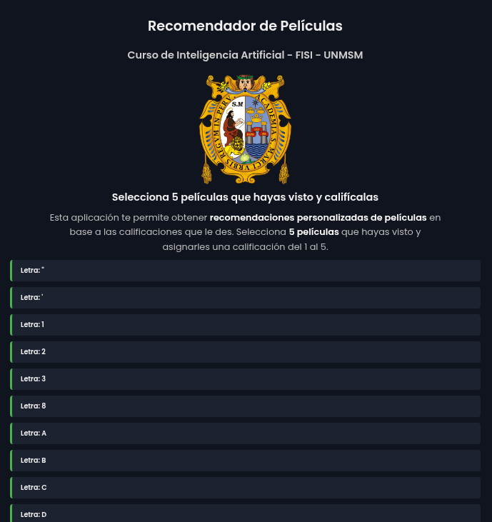
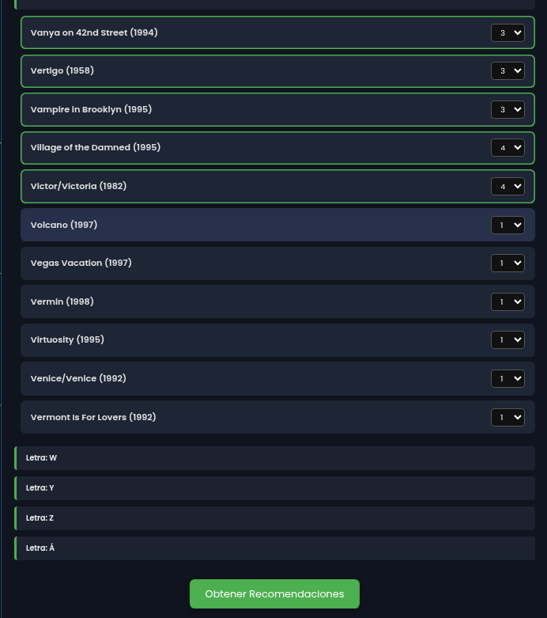
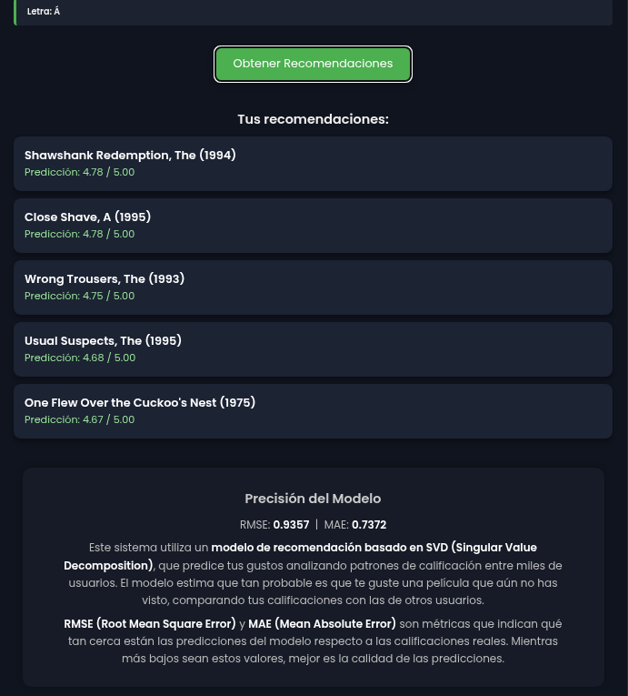

# Sistema Recomendador de Películas

**Universidad:** Universidad Nacional Mayor de San Marcos
**Facultad:** Facultad de Ingeniería de Sistemas e Informática  
**Curso:** Inteligencia Artificial

Este proyecto consiste en una **aplicación web con un sistema de recomendación de películas personalizado**, el cual utiliza SVD que es una técnica de aprendizaje no supervisado para predecir qué películas podrían gustarle a un usuario en función de sus preferencias.

---

## Descripción General

El sistema permite al usuario seleccionar 5 películas que haya visto y asignarles una calificación entre 1 y 5. Con esta información, el modelo entrenado genera una lista personalizada de recomendaciones basada en patrones de comportamiento similares entre usuarios.

---

## Modelo de Recomendación Utilizado

El sistema está basado en **SVD (Singular Value Decomposition)**, una técnica de descomposición matricial ampliamente usada en sistemas de recomendación colaborativos.

### ¿Cómo funciona?
1. **Entrada del usuario**: Selección de 5 películas calificadas por el usuario.
2. **Reentrenamiento del modelo**: Se combina la calificación del usuario con las calificaciones históricas del dataset.
3. **Predicción**: El modelo estima qué tan probable es que al usuario le guste una película no vista.
4. **Ranking**: Se seleccionan las N mejores predicciones y se devuelven al usuario como recomendaciones.

### Métricas del modelo
- **RMSE (Root Mean Squared Error)**: Indica el error cuadrático promedio de las predicciones.
- **MAE (Mean Absolute Error)**: Muestra el error absoluto promedio.

---

## 🗂️ Estructura del Proyecto
```
└── prediccion-peliculas-svd/
    ├── main.py
    ├── requirements.txt
    ├── app_web/
    │   ├── index.html
    │   ├── index.js
    │   ├── style.css
    │   └── dataset_movies/
    │       └── movies.csv
    └── dataset_model_script/
        ├── modelo.py
        ├── datasets/
        │   ├── datasets_procesados/
        │   │   ├── movies.csv
        │   │   └── ratings.csv
        │   ├── datasets_sin_procesar/
        │   │   ├── u.data
        │   │   └── u.item
        │   ├── graficos/
        │   │   ├── distribucion.py
        │   │   └── histograma.py
        │   └── preprocessing/
        │       ├── processing_data.py
        │       └── processing_item.py
        └── model/
            ├── metricas.json
            └── svd_model

```
# Imagenes del proyecto

<div align="center">
  
  
  
</div>

# Link del proyecto
### [prediccion-peliculas-svd.onrender](https://prediccion-peliculas-svd.onrender.com)